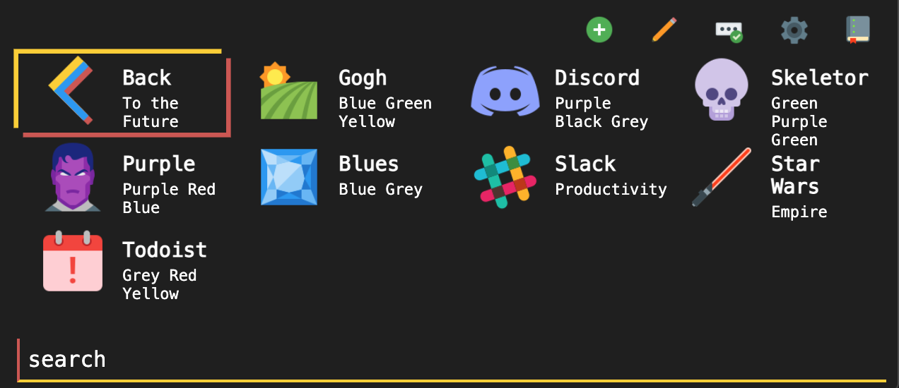

# Tiles
A keyboard centric, feature rich, responsive design homepage!

[](https://github.com/boettner-eric/homepage/issues)


## [**Live Demo**](https://boettner-eric.github.io/Tiles/index.html)


### Benefits over **[Homepage](https://github.com/Boettner-eric/Homepage)**

* Entire js rewrite
* Clearer data structure with one static index.html file
* Support for preloading icons
* Major bug fixes and stability improvements
* Clearer code and documentation -> much easier customization
* Lib.js allows for easy addition and deletion of tiles and themes
* Live search and external searches
* Cool new themes
* Better mobile support
* Live search and definitions


## Setup
* Add any custom tiles to lib.js
* Add your api key to the var "api" for open weather and news updates


## Features
* Keyboard navigation and shortcuts
* Full mobile support
* Simple and clear data structure for customization
* Dynamic approach towards page generation
* Multiple themes and easy support for adding new ones
* Live "tile" search as well as external api search
* External api support for tiles (in progress)

### Keyboard Shortcuts

Function | Key | Description
--- | --- | ---
up | `j` / `up` | up one tile
down | `k` / `down` | down one tile
left | `h` / `left` | left one tile
right | `l` / `right` | right one tile
hop | `1...0`, `-`, `+` | hop to any tile #
search | `[space]` | starts live search
api search | `/` | searches external sources
themes | `\` | opens theme menu  
enter | `[enter]` | go to tile / exit search
esc | `[esc]` | close search, return to homepage

### Mobile Support
* Fixed css breakpoints and general layout improvements
* Full featured w/o different file base


### Data structure
#### Tile syntax
There are 3 types of tile that all use similar syntax:
1. Tiles represent static webpages. `["url","icn","title","subtitle"]`
2. Folders represent a key for a array of tiles.
`["#key-name","icn","title","subtitle"]`
3. Themes repersent tiles for a given theme name
`["$theme-name","icn","title",["background","main color","alt color","main text","subtext"]]`
4. Themes can also have background images
`["$theme-name","icn","title",["image_url","main color","alt color","main text","subtext"]]`
5. References represent simple tiles for duplicate entries
`["~Title"]` for a given tile in `pages["~"]`

```js
Example
  tile = ["https://github.com","gh","Github","Code"]
  folder = ["#","mt","Code","~/hack.sh"]
  theme = ["$","ds","Discord","Purple, Black, Grey",['#23272A','#2C2F33','#7289DA','#7289DA','#99AAB5']]
  wallpaper = ["$","pnr","Starry Night","Blue Green Yellow",["src/wall/starry.jpg","#007849","#FECE00","#FFFFFF","#FFFFFF"]]
  reference = ["~Github"]
```
Both themes and tiles are stored in lib.js -> look there for more info and examples

### Icons8
Icons taken from [Icons 8](https://icons8.com)

### Themes


Theme | Bg | Main | Comp| Sub | Txt | Credit |
  --- | --- | --- | --- | --- | --- | --- |
*Skeletor* |![S1]|![S2]|![S3]|![S4]|![S5]|[`Syntax`](https://atom.io/themes/skeletor-syntax#color-palette)
*Switch* |![W1]|![W2]|![W3]|![W4]|![W5]|[`Switch`](https://www.nintendo.com/switch/)
*Gogh* |![G1]|![G2]|![G3]|![G4]|![G5]|[`Gogh`](https://colourlex.com/project/van-gogh-starry-night/)
*Todoist* |![T1]|![T2]|![T3]|![T4]|![T5]|[`Todoist Dark`](https://todoist.com)
*Discord* |![D1]|![D2]|![D3]|![D4]|![D5]|[`Discord`](https://discordapp.com/branding)
*Terminal* |![E1]|![E2]|![E3]|![E4]|![E5]|`None`
*Lava* |![L1]|![L2]|![L3]|![L4]|![L5]|`None`
*Purple* |![P1]|![P2]|![P3]|![P4]|![P5]|`None`
(table generated with help from **[placehold.it](https://placehold.it)**)

##### See code for detailed documentation for each function

## Credits
1. Icons from icons8
2. Theme colors from sources listed in table
3. Original code from my other [`repo`](https://github.com/Boettner-eric/Homepage) which started as [`Decaux`](https://github.com/Boettner-eric/Decaux) which has been abandoned and deleted
4. Snippets referenced from exterior sources
  - [`Iphone scaling fixes`](https://stackoverflow.com/questions/6483425/prevent-iphone-from-zooming-in-on-select-in-web-app)
  - [`Overscrolling bug`](https://stackoverflow.com/questions/12046315/prevent-overscrolling-of-web-page)
  - [`Array sorting logic`](https://stackoverflow.com/questions/11499268/sort-two-arrays-the-same-way)

[S1]:https://placehold.it/100x50/2b2836/ffffff/?text=2b2836
[S2]:https://placehold.it/100x50/93b4ff/ffffff/?text=93b4ff
[S3]:https://placehold.it/100x50/bd93f9/ffffff/?text=bd93f9
[S4]:https://placehold.it/100x50/84fba2/2b2836/?text=84fba2
[S5]:https://placehold.it/100x50/ffffff/2b2836/?text=ffffff
[W1]:https://placehold.it/100x50/414548/ffffff/?text=414548
[W2]:https://placehold.it/100x50/ff4554/ffffff/?text=ff4554
[W3]:https://placehold.it/100x50/00c3e3/ffffff/?text=00c3e3
[W4]:https://placehold.it/100x50/ffffff/414548/?text=ffffff
[W5]:https://placehold.it/100x50/ffffff/414548/?text=ffffff
[G1]:https://placehold.it/100x50/0375B4/FFFFFF/?text=0375B4
[G2]:https://placehold.it/100x50/007849/FFFFFF/?text=007849
[G3]:https://placehold.it/100x50/FECE00/FFFFFF/?text=FECE00
[G4]:https://placehold.it/100x50/FFFFFF/0375B4/?text=ffffff
[G5]:https://placehold.it/100x50/FFFFFF/0375B4/?text=ffffff
[T1]:https://placehold.it/100x50/1f1f1f/ffffff/?text=1f1f1f
[T2]:https://placehold.it/100x50/fccf1b/ffffff/?text=fccf1b
[T3]:https://placehold.it/100x50/cd5650/ffffff/?text=cd5650
[T4]:https://placehold.it/100x50/ffffff/1f1f1f/?text=ffffff
[T5]:https://placehold.it/100x50/ffffff/1f1f1f/?text=ffffff
[E1]:https://placehold.it/100x50/282828/33FF33/?text=282828
[E2]:https://placehold.it/100x50/282828/33FF33/?text=282828
[E3]:https://placehold.it/100x50/33FF33/?text=33FF33
[E4]:https://placehold.it/100x50/33FF33/282828/?text=33FF33
[E5]:https://placehold.it/100x50/33FF33/282828/?text=33FF33
[D1]:https://placehold.it/100x50/23272A/99AAB5/?text=23272A
[D2]:https://placehold.it/100x50/2C2F33/99AAB5/?text=2C2F33
[D3]:https://placehold.it/100x50/7289DA/99AAB5/?text=7289DA
[D4]:https://placehold.it/100x50/7289DA/23272A/?text=7289DA
[D5]:https://placehold.it/100x50/99AAB5/23272A/?text=99AAB5
[L1]:https://placehold.it/100x50/000000/99AAB5/?text=000000
[L2]:https://placehold.it/100x50/D32F2F/99AAB5/?text=D32F2F
[L3]:https://placehold.it/100x50/DD4132/99AAB5/?text=DD4132
[L4]:https://placehold.it/100x50/99AAB5/000000/?text=99AAB5
[L5]:https://placehold.it/100x50/99AAB5/000000/?text=99AAB5
[P1]:https://placehold.it/100x50/6B5B95/F0EDE5/?text=6B5B95
[P2]:https://placehold.it/100x50/FF383F/F0EDE5/?text=FF383F
[P3]:https://placehold.it/100x50/223A5E/F0EDE5/?text=223A5E
[P4]:https://placehold.it/100x50/F0EDE5/6B5B95/?text=F0EDE5
[P5]:https://placehold.it/100x50/F0EDE5/6B5B95/?text=F0EDE5
