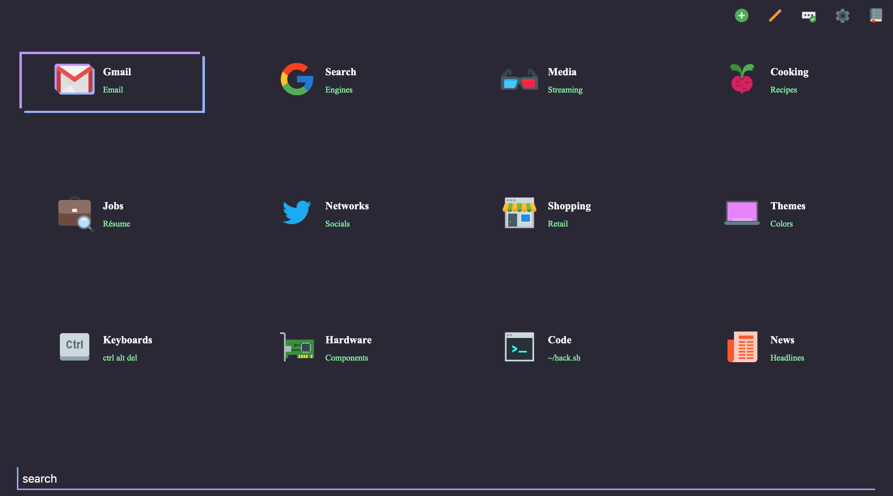

# Tiles
A keyboard-centric, feature rich, responsive design homepage.

[](https://github.com/boettner-eric/homepage/issues)


## [**Live Demo**](https://boettner-eric.github.io/Tiles/index.html)



## Features
* Keyboard navigation
* Mobile support
* Simple commands for page customization
* Support for custom color schemes
* Live tile search and search engine integration

### Version 2.0
* Backend using Node/MongoDB and Heroku hosting
* Database model for storing multiple user configurations
* Updated structure and security

### Commands
Command | Parameters | Description
--- | --- | --- |
!reload | | reload user's page (for server errors)
!register | `username` `password` | create a new user profile
!login | `username` `password` | login to existing profile
!logout | | logout current user
!set | `theme` | sets default color scheme for user
 | `grid` `width` `height` | change the dimensions of the page grid
 | `font` `font-name` | change the users default font
!tile | `url` `title` `subtitle` `~img` | adds a tile to current page
!folder | `title` `subtitle` `~img` | adds a folder tile to current page
!theme | `title` `subtitle` `~img` `colors` | adds a new color scheme to themes folder
!search | `url` `title` `subtitle` `~img` | adds a new search tile
!edit | `title` `field`=`value` | change any field of a tile
!delete | `title` | deletes tile from user's page
!swap | `title` `title` | swaps position of two tiles on page (works best if first tile is earlier on page)

### Command Examples
```
!set theme Gogh // changes user's default theme

!set grid 4 3 // changes user's default grid to 4x3 and reloads page

!tile www.google.com Google Search ~google-logo // create a tile for google on current page

!search https://duckduckgo.com/?q= DuckDuckGo Privacy ~duckduckgo // creates a search tile for google

!edit Github subtitle=repos img=~github--v1 // changes icon and subtitle for github tile on current page

!edit Discord theme=#23272A,#2C2F33,#7289DA,#99AAB5,#7289DA // changes color scheme for discord theme (note commas here)
```

### Themes
* Since this version of tiles customization focused I omitted the default themes.
* To add them to your page I included commands for most of the old themes here. (just copy and paste each line into the search bar)

```
!theme Discord Purple-Black-Grey ~discord-logo #23272A #2C2F33 #7289DA #99AAB5 #7289DA

!theme Skeletor Green-Purple-Green ~thriller #2b2836 #93b4ff #bd93f9 #ffffff #84fba2

!theme Terminal Green-Black ~console #282828 #282828 #33FF33 #33FF33 #33FF33

!theme Gogh Blue-Green-Yellow ~field #0375B4 #007849 #FECE00 #FFFFFF #FFFFFF

!theme Todoist Grey-Red-Yellow ~reminders #1f1f1f #fccf1b #cd5650 #ffffff #ffffff

!theme Switch Grey-Red-Blue ~nintendo-switch #414548 #ff4554 #00c3e3 #ffffff #ffffff

!theme Lava Red-Black ~volcano #000000 #D32F2F #DD4132 #99AAB5 #99AAB5

!theme Purple Purple-Red-Blue ~purple-man #6B5B95 #FF383F #223A5E #F0EDE5 #F0EDE5

!theme Blues Blue-Grey ~sapphire #25274D #2E9CCA #29648A #ffffff #AAABB8
```
* The format for themes is `background/image, main color, complementary color, title text, subtitle text`

### Keyboard Shortcuts

Function | Key | Description
--- | --- | ---
up | `k` / `up` | up one tile
down | `j` / `down` | down one tile
left | `h` / `left` | left one tile
right | `l` / `right` | right one tile
hop | `1...0`, `-`, `+` | hop to any tile #
search | `[space]` | starts live search
api search | `/` | searches external sources
themes | `\` | opens theme menu
enter | `[enter]` | go to tile / exit search
esc | `[esc]` | close search, return to homepage


## Setup
* `!register username password`
* Customize page configuration and user settings with commands

### Getting Started
- On first login a user's page will only include the theme and search folders.
- To make the process easier for a first time user I added the following commands for a default configuration.

```javascript
!register username password // create a new user
!search www.google.com/search?q= Google Search ~google-logo // create a tile for google on current page
!folder Media Streaming ~3d-glasses // adds a media page
!theme Gogh Blue-Green-Yellow ~field #0375B4 #007849 #FECE00 #FFFFFF #FFFFFF // adds a new theme
!set theme Gogh // sets new theme as main theme
!set grid 4 3 // sets a 4x3 grid for tiles
```

## Hosting Notes
- The server is set to be most responsive from 8-24 PST.
- My hosting goes through a sleep schedule so initial response times will be delayed for requests outside of that time range.
- Maintenance will occur during these evening periods.

### Icons8
To add an icon for a tile/page/theme:
- Go to [icons8.com](icons8.com)
- Search for the icon you want (set the style to color)


- Click on the icon you want and find the icons real name


- Use this name in your command

    `!tile https://google.com Google Search ~google-logo`
- Make sure to use the tilde in front of the image name

## Notes
* Backend will be open-sourced in the next few weeks.
* Spaces are replaced by `-` in commands.
    * ex. `!tile url Bon-Apétit Recipes ~cooking`
* There are still some bugs involving pages longer than the grid
* If you run into some bug involving blank tiles reload the page and it should resolve.
* I would recommend leaving the `Themes` and `Search` pages on your homepage to hold all theme and search tiles.

 (If you don't themes and searches will still function but the page to edit them will be unreachable)
* Feel free to reach out if you have any questions/bugs.


## Credits
1. Icons from [Icons 8](https://icons8.com)
2. Theme hex colors from multiple brands and themes
3. Original code from my other [`repo`](https://github.com/Boettner-eric/Homepage) which started as [`Decaux`](https://github.com/Boettner-eric/Decaux) which has been abandoned
5. Kishlaya's fork for dynamic html generation
