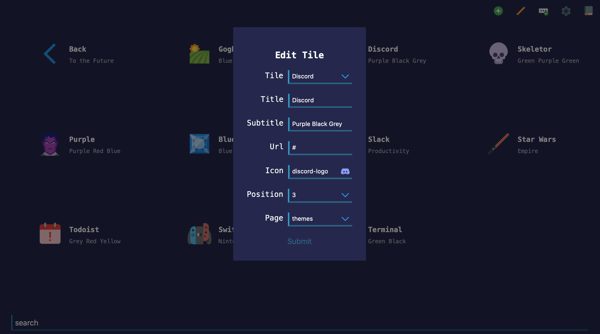

# Tiles
A keyboard-centric, feature-rich, responsive design based homepage.

## [**Live Site**](https://boettner-eric.github.io/Tiles/index.html)

## Features
* Keyboard navigation
* Mobile support
* Form interface for adding tiles
* Support for custom color schemes
* Tile search and search engine integration

### Recent Changes
* Custom form interfaces for user input (replaces commands)
* Better server/client communication
* Faster searching
* General Optimizations
* Refactored of JS code

### Keyboard Shortcuts

Function | Key | Description
--- | --- | ---
up | `k` / `up` | up one tile
down | `j` / `down` | down one tile
left | `h` / `left` | left one tile
right | `l` / `right` | right one tile
hop | `1...0`, `-`, `+` | hop to any tile #
search | `[space]` | starts live search
api search | `/` | searches external sources
themes | `\` | opens theme menu
enter | `[enter]` | go to tile / exit search
esc | `[esc]` | close search, return to homepage

### Forms
* Simple popup forms allow for user input
* Forms have smart input fields for logins and icons

### Themes
* Since this version of tiles is customization focused I omitted the default themes.
* To add them to your page I included the colors for the original themes and the file [themes.txt](themes.txt) contains commands you can copy and paste into the search bar for each theme.

Theme | Icons8 | Background | Top | Bottom | Text | Subtext | Credit |
  --- | --- | --- | --- | --- | --- | --- | --- |
*Skeletor* | thriller |![S1]|![S3]|![S2]|![S5]|![S4]|[`Syntax`](https://atom.io/themes/skeletor-syntax#color-palette)
*Switch* | nintendo-switch |![W1]|![W2]|![W3]|![W4]|![W5]|[`Switch`](https://www.nintendo.com/switch/)
*Gogh* | field |![G1]|![G3]|![G2]|![G4]|![G5]|[`Gogh`](https://colourlex.com/project/van-gogh-starry-night/)
*Todoist* | leave |![T1]|![T2]|![T3]|![T4]|![T5]|[`Todoist Dark`](https://todoist.com)
*Discord* | discord-logo |![D1]|![D3]|![D2]|![D5]|![D4]|[`Discord`](https://discordapp.com/branding)
*Terminal* | console |![E1]|![E2]|![E4]|![E4]|![E5]|`None`
*Lava* | volcano |![L1]|![L2]|![L1]|![L4]|![L5]|`None`
*Purple* | purple-man |![P1]|![P3]|![P2]|![P4]|![P5]|`None`

(table generated from **[placehold.it](https://placehold.it)**)

### Custom sized grid
* Tiles now supports custom sized grids which can be set in the settings form

### Hosting Notes
- The server is set to be most responsive from 8-24 PST.
- My hosting goes through a sleep schedule so initial response times will be delayed for requests outside of that time range.
- Maintenance will occur during these evening periods.

### Icons8
To add an icon for a tile/page/theme:
- Go to [icons8.com](icons8.com)
- Search for the icon you want (set the style to color)

- Click on the icon you want and find the icons real name

- Use this icon name in your command or in the input form

    `!tile https://google.com Google Search ~google-logo`

## Notes
* Backend will be open-sourced in the next few weeks.
* Spaces are replaced by `-` in commands. (use normal spaces in forms)
    * ex. `!tile url Bon-Apétit Recipes ~cooking`
* There are still some bugs involving pages longer than the grid
* If you run into some bug involving blank tiles reload the page and it should resolve.
* I would recommend leaving the `Themes` and `Search` pages on your homepage to hold all theme and search tiles.

 (If you don't themes and searches will still function but the page to edit them will be unreachable)
* Feel free to reach out if you have any questions/bugs.

## Credits
1. Icons from [Icons 8](https://icons8.com)
2. Theme hex colors from multiple brands and themes
3. Original code from my other [`repo`](https://github.com/Boettner-eric/Homepage) which started as [`Decaux`](https://github.com/Boettner-eric/Decaux) which has been abandoned
5. Kishlaya's fork for dynamic html generation

[S1]:https://placehold.it/100x50/2b2836/ffffff/?text=2b2836
[S2]:https://placehold.it/100x50/93b4ff/ffffff/?text=93b4ff
[S3]:https://placehold.it/100x50/bd93f9/ffffff/?text=bd93f9
[S4]:https://placehold.it/100x50/84fba2/2b2836/?text=84fba2
[S5]:https://placehold.it/100x50/ffffff/2b2836/?text=ffffff
[W1]:https://placehold.it/100x50/414548/ffffff/?text=414548
[W2]:https://placehold.it/100x50/ff4554/ffffff/?text=ff4554
[W3]:https://placehold.it/100x50/00c3e3/ffffff/?text=00c3e3
[W4]:https://placehold.it/100x50/ffffff/414548/?text=ffffff
[W5]:https://placehold.it/100x50/ffffff/414548/?text=ffffff
[G1]:https://placehold.it/100x50/0375B4/FFFFFF/?text=0375B4
[G2]:https://placehold.it/100x50/007849/FFFFFF/?text=007849
[G3]:https://placehold.it/100x50/FECE00/FFFFFF/?text=FECE00
[G4]:https://placehold.it/100x50/FFFFFF/0375B4/?text=ffffff
[G5]:https://placehold.it/100x50/FFFFFF/0375B4/?text=ffffff
[T1]:https://placehold.it/100x50/1f1f1f/ffffff/?text=1f1f1f
[T2]:https://placehold.it/100x50/fccf1b/ffffff/?text=fccf1b
[T3]:https://placehold.it/100x50/cd5650/ffffff/?text=cd5650
[T4]:https://placehold.it/100x50/ffffff/1f1f1f/?text=ffffff
[T5]:https://placehold.it/100x50/ffffff/1f1f1f/?text=ffffff
[E1]:https://placehold.it/100x50/282828/33FF33/?text=282828
[E2]:https://placehold.it/100x50/282828/33FF33/?text=282828
[E3]:https://placehold.it/100x50/282828/33FF33/?text=33FF33
[E4]:https://placehold.it/100x50/33FF33/282828/?text=33FF33
[E5]:https://placehold.it/100x50/33FF33/282828/?text=33FF33
[D1]:https://placehold.it/100x50/23272A/99AAB5/?text=23272A
[D2]:https://placehold.it/100x50/2C2F33/99AAB5/?text=2C2F33
[D3]:https://placehold.it/100x50/7289DA/99AAB5/?text=7289DA
[D4]:https://placehold.it/100x50/7289DA/23272A/?text=7289DA
[D5]:https://placehold.it/100x50/99AAB5/23272A/?text=99AAB5
[L1]:https://placehold.it/100x50/000000/99AAB5/?text=000000
[L2]:https://placehold.it/100x50/D32F2F/99AAB5/?text=D32F2F
[L3]:https://placehold.it/100x50/DD4132/99AAB5/?text=DD4132
[L4]:https://placehold.it/100x50/99AAB5/000000/?text=99AAB5
[L5]:https://placehold.it/100x50/99AAB5/000000/?text=99AAB5
[P1]:https://placehold.it/100x50/6B5B95/F0EDE5/?text=6B5B95
[P2]:https://placehold.it/100x50/FF383F/F0EDE5/?text=FF383F
[P3]:https://placehold.it/100x50/223A5E/F0EDE5/?text=223A5E
[P4]:https://placehold.it/100x50/F0EDE5/6B5B95/?text=F0EDE5
[P5]:https://placehold.it/100x50/F0EDE5/6B5B95/?text=F0EDE5
